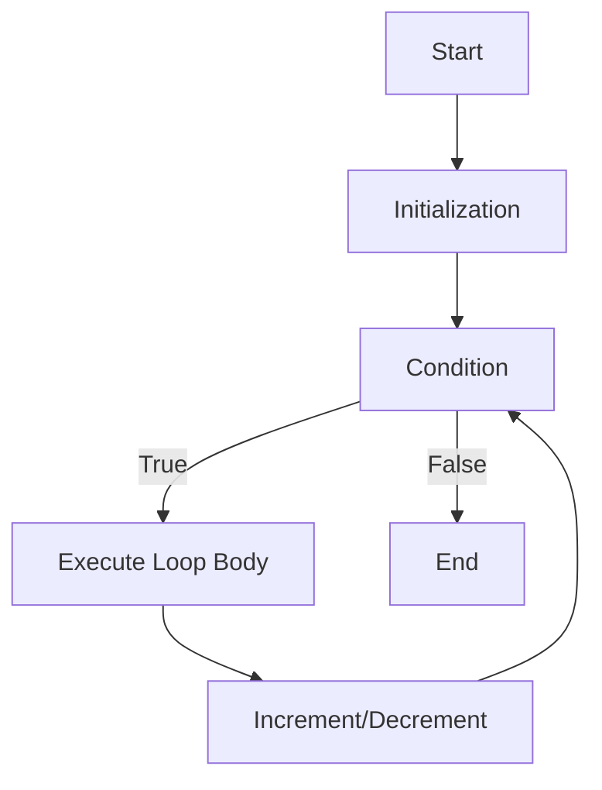
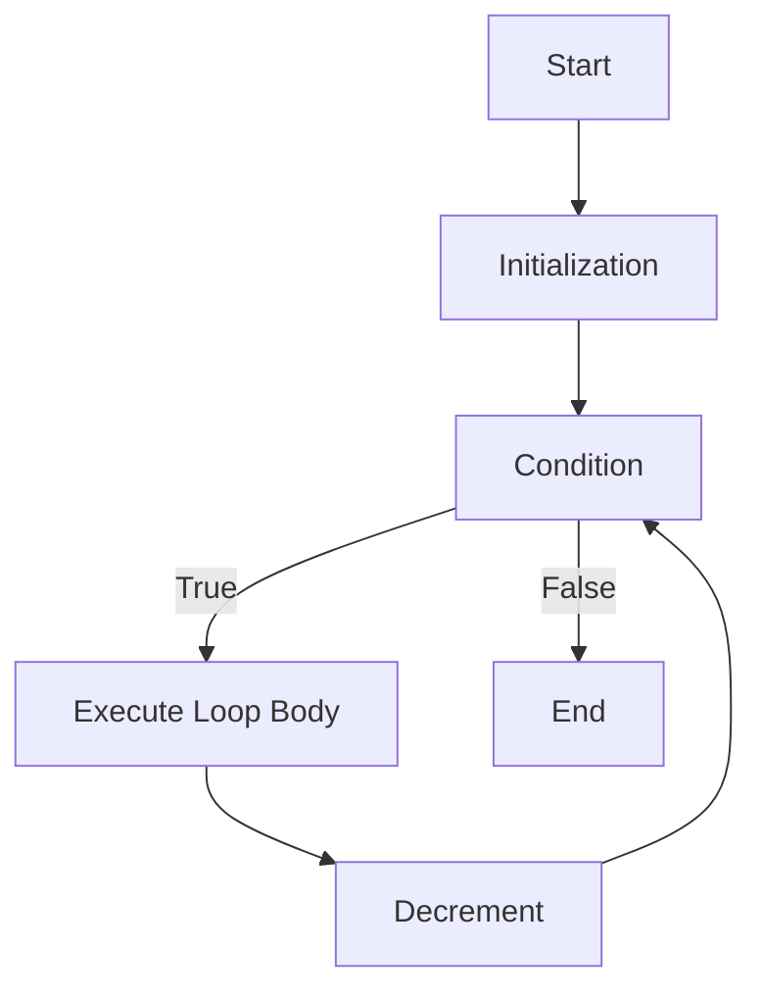
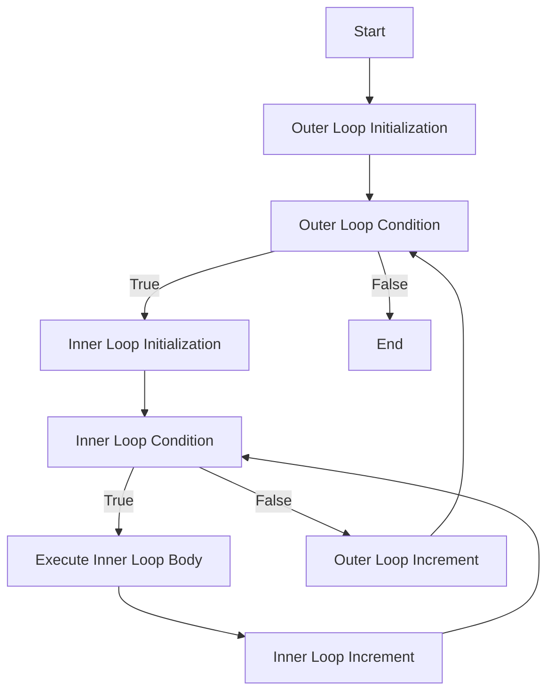

# Notes on Loops in Java

## Table of Contents
1. [Introduction](#introduction)
2. [For Loop](#for-loop)
3. [While Loop](#while-loop)
4. [Do-While Loop](#do-while-loop)
5. [Enhanced For Loop](#enhanced-for-loop)
6. [Nested Loops](#nested-loops)
7. [Loop Control Statements](#loop-control-statements)
8. [Reverse Loop](#reverse-loop)
9. [Matrix Pattern](#matrix-pattern)

## Introduction
Loops are used in Java to execute a block of code repeatedly. Java provides several types of loops to handle different looping requirements.

## For Loop
The `for` loop is used when the number of iterations is known. It consists of three parts: initialization, condition, and increment/decrement.

```java
for (int i = 0; i < 10; i++) {
    System.out.println(i);
}
```

## While Loop
The `while` loop is used when the number of iterations is not known and depends on a condition.

```java
int i = 0;
while (i < 10) {
    System.out.println(i);
    i++;
}
```

## Do-While Loop
The `do-while` loop is similar to the `while` loop, but it guarantees at least one iteration.

```java
int i = 0;
do {
    System.out.println(i);
    i++;
} while (i < 10);
```

## Enhanced For Loop
The enhanced `for` loop, also known as the "for-each" loop, is used to iterate over arrays or collections.

```java
int[] numbers = {1, 2, 3, 4, 5};
for (int number : numbers) {
    System.out.println(number);
}
```

## Nested Loops
Loops can be nested within each other to handle more complex iterations.

```java
for (int i = 0; i < 3; i++) {
    for (int j = 0; j < 3; j++) {
        System.out.println("i: " + i + ", j: " + j);
    }
}
```

## Loop Control Statements
Java provides control statements to manage the flow of loops:
- `break`: Exits the loop.
- `continue`: Skips the current iteration and proceeds to the next iteration.

```java
for (int i = 0; i < 10; i++) {
    if (i == 5) {
        break; // Exit the loop when i is 5
    }
    if (i % 2 == 0) {
        continue; // Skip even numbers
    }
    System.out.println(i);
}
```

## Reverse Loop
A reverse loop iterates in the opposite direction, typically from a higher value to a lower value.

```java
for (int i = 10; i >= 0; i--) {
    System.out.println(i);
}
```

## Matrix Pattern
Matrix patterns can be created using nested loops. Here is an example of a simple matrix pattern:

```java
for (int i = 1; i <= 3; i++) {
    for (int j = 1; j <= 3; j++) {
        System.out.print(i * j + " ");
    }
    System.out.println();
}
```

## Mermaid Diagrams

### For Loop


### Reverse Loop


### Matrix Pattern
