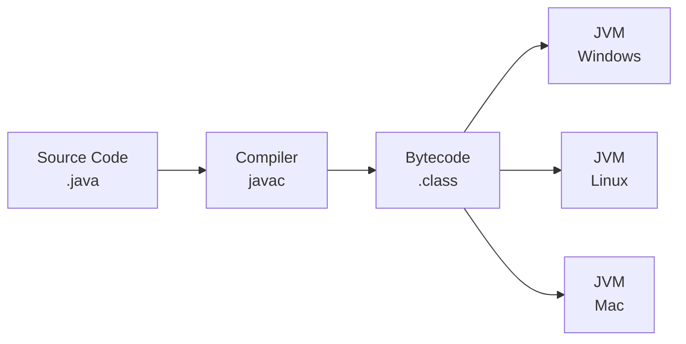
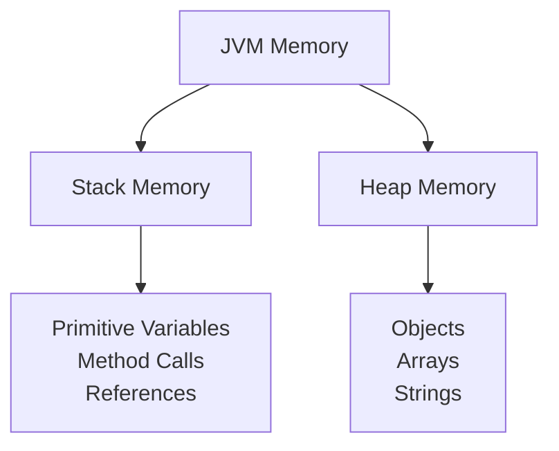
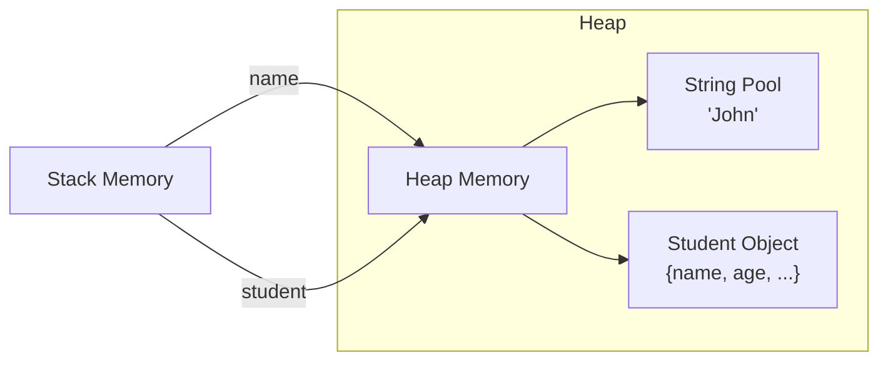
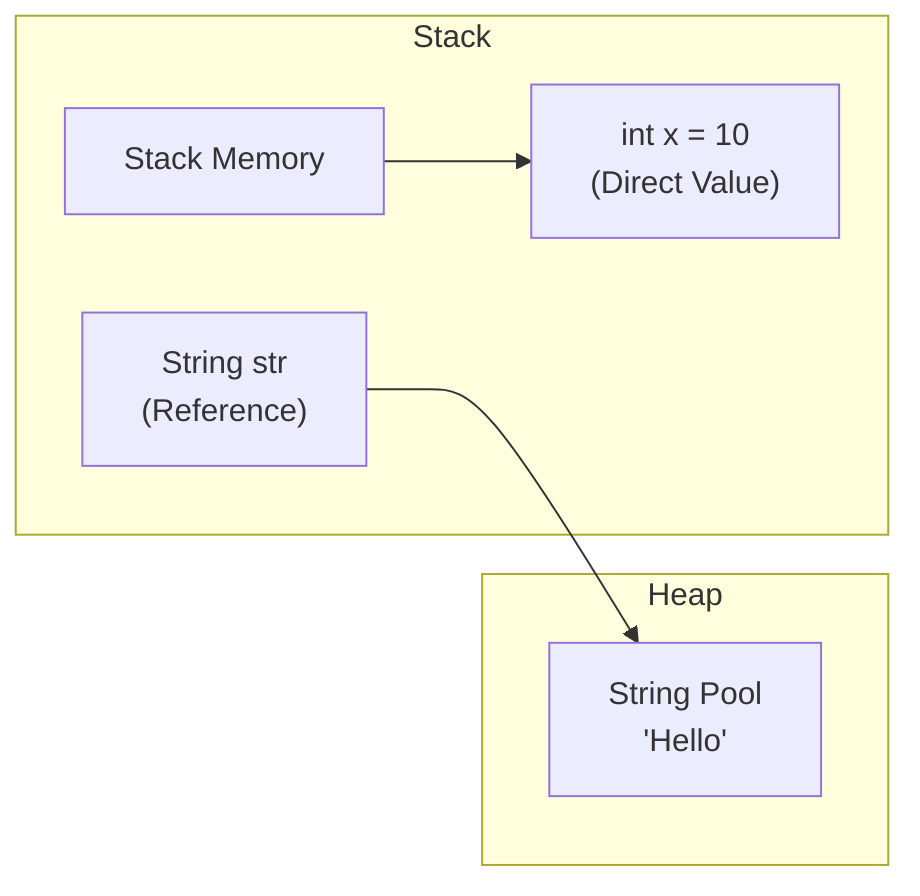

# Java Programming Notes

## Table of Contents
1. [Introduction](#introduction)
2. [Features](#features)
3. [Data Types](#data-types)
4. [Variables](#variables)
5. [Type Conversion](#type-conversion)
6. [Input/Output](#input-output)
7. [Memory Management](#memory-management)

## Introduction

Java is a class-based, object-oriented programming language designed to be platform-independent.

### How Java Works


## Features

- Platform Independence (WORA)
- Object-Oriented
- Robust and Secure
- Multithreaded
- Automatic Memory Management
- Rich Standard Library

## Data Types

### Primitive Types Range

| Data Type | Size | Range |
|-----------|------|-------|
| byte | 1 byte | -128 to 127 |
| short | 2 bytes | -32,768 to 32,767 |
| int | 4 bytes | -2,147,483,648 to 2,147,483,647 |
| long | 8 bytes | -9,223,372,036,854,775,808 to 9,223,372,036,854,775,807|
| float | 4 bytes | ±3.4e−038 to ±3.4e+038 |
| double | 8 bytes | ±1.7e−308 to ±1.7e+308 |
| char | 2 bytes | 0 to 65,535 |
| boolean | 1 bit | true/false |

### Reference Types
- Objects
- Arrays
- String
- Classes
- Interfaces

## Variables

### Types of Variables
1. **Local Variables**
    - Declared inside methods
    - Must be initialized before use
   ```java
   void method() {
       int x = 10;  // Local variable
   }
   ```

2. **Instance Variables**
    - Declared in class, outside methods
    - Have default values
   ```java
   class Student {
       int rollNo;  // Instance variable
       String name; // Instance variable
   }
   ```

3. **Static Variables**
    - Shared across all instances
    - Class level variables
   ```java
   class School {
       static String schoolName;  // Static variable
   }
   ```

## Type Conversion

### Implicit Conversion (Widening)
```java
// Automatic type conversion
byte b = 10;
int i = b;     // byte to int
long l = i;    // int to long
float f = l;   // long to float
double d = f;  // float to double
```

### Explicit Conversion (Narrowing)
```java
// Manual type casting
double d = 100.04;
float f = (float)d;    // double to float
long l = (long)f;      // float to long
int i = (int)l;        // long to int
short s = (short)i;    // int to short
```

## Input/Output

### Scanner Class
```java
import java.util.Scanner;

Scanner scanner = new Scanner(System.in);

// Reading input
String name = scanner.nextLine();    // Read string
int age = scanner.nextInt();         // Read integer
double salary = scanner.nextDouble(); // Read double
```

### BufferedReader
```java
import java.io.BufferedReader;
import java.io.InputStreamReader;

BufferedReader reader = new BufferedReader(new InputStreamReader(System.in));
String line = reader.readLine();
```

## Memory Management

### Memory Structure


### Memory Examples

#### Stack Memory
```java
int age = 25;        // Stored directly in stack
boolean isValid = true;  // Stored directly in stack
```

#### Heap Memory


### Variable Memory Visualization


## Best Practices

1. **Naming Conventions**
    - Classes: PascalCase (StudentRecord)
    - Methods/Variables: camelCase (studentAge)
    - Constants: UPPER_SNAKE_CASE (MAX_VALUE)

2. **Memory Management**
    - Close resources (Scanner, BufferedReader)
    - Avoid memory leaks
    - Use appropriate data types

3. **Type Conversion**
    - Be careful with narrowing conversions
    - Check for data loss in conversions
    - Use proper casting when needed